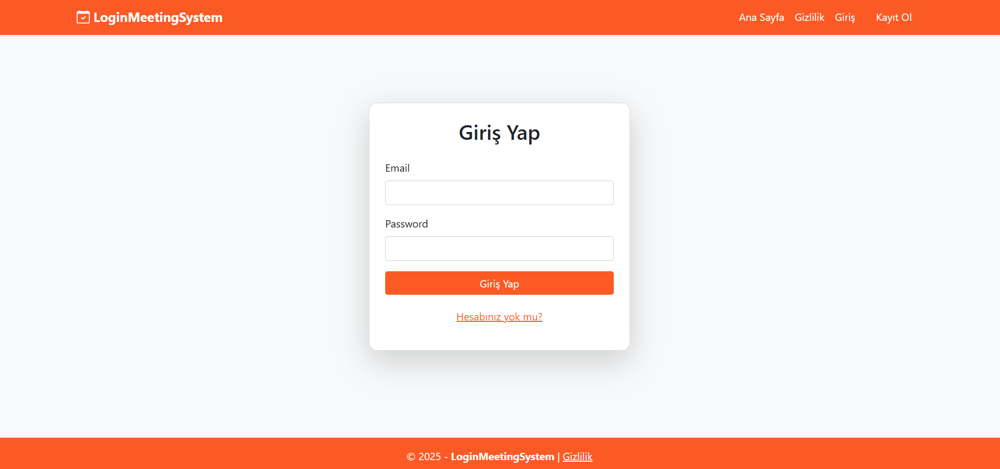
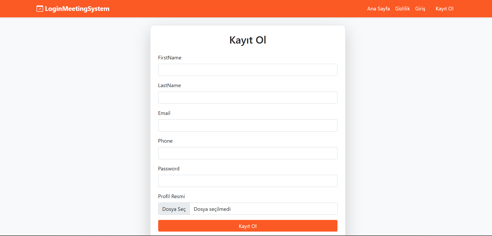
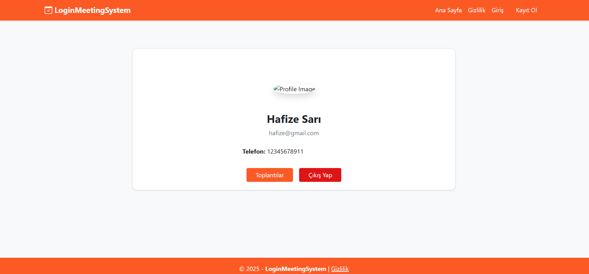
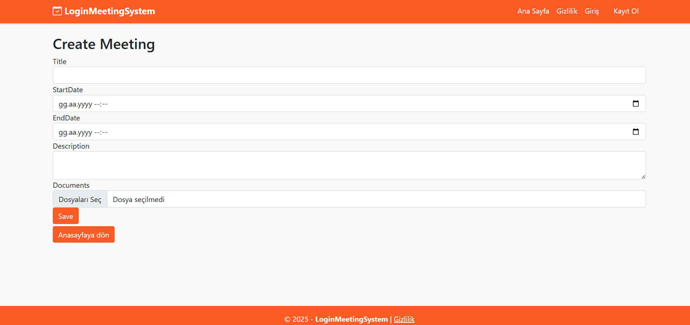
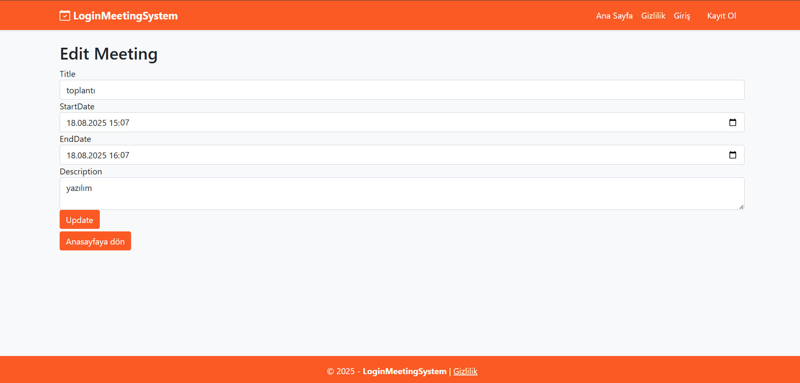

# Login & Meeting System

Bu proje, kullanıcıların sisteme kayıt olup giriş yapabildiği,
profil bilgilerini yönetebildiği ve toplantı oluşturma / listeleme / güncelleme işlemlerini gerçekleştirebildiği bir **ASP.NET MVC** uygulamasıdır.

---

## 🚀 Özellikler

- Kullanıcı kayıt (Register)
- Kullanıcı giriş (Login)
- Profil görüntüleme
- Toplantı oluşturma
- Toplantıları listeleme
- Toplantı güncelleme

---

## 🛠️ Kullanılan Teknolojiler

- ASP.NET MVC
- .NET 7
- Razor View
- HTML / CSS
- Git & GitHub

---

## 📸 Uygulama Ekran Görüntüleri

### 🏠 Anasayfa


---

### 🔐 Giriş Sayfası


---

### 📝 Kayıt Sayfası


---

### 👤 Profil Sayfası


---

### 📅 Toplantılar


---

### ➕ Toplantı Oluşturma


---

### ✏️ Toplantı Güncelleme


---

## ▶️ Projeyi Çalıştırma

```bash
dotnet restore
dotnet run
```
📁 Klasör Yapısı
```text
LoginMeetingSystem
│
├── Controllers
├── Data
├── Migrations
├── Models
├── obj
├── Properties
├── Views
├── wwwroot
├── images
│   ├── anasayfa.png
│   ├── giris.png
│   ├── kayıt.png
│   ├── profil.png
│   ├── toplantılar.png
│   ├── toplantıolusturma.png
│   └── toplantıgüncelleme.png
└── README.md
